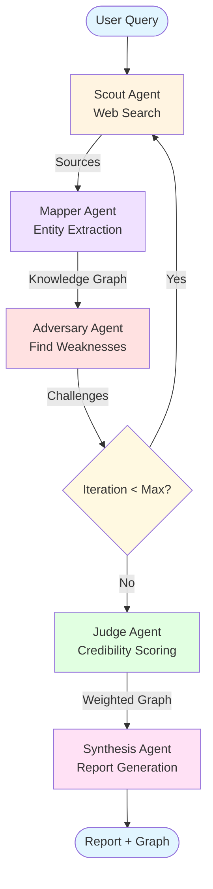

# Adversarial Knowledge Cartographer

> **A production-grade multi-agent AI research system that transforms controversial topics into structured knowledge graphs with conflict detection and credibility scoring.**

[](https://github.com/yourusername/adversarial-knowledge-cartographer/actions)
[](https://codecov.io/gh/yourusername/adversarial-knowledge-cartographer)
[](https://opensource.org/licenses/MIT)
[](https://www.python.org/downloads/)

**[Live Demo](#) | [Documentation](docs/) | [API Reference](api/README.md) | [Contributing](CONTRIBUTING.md)**

---

## What Makes This Different?

Unlike traditional research agents that simply summarize information, this system:

- **Actively seeks contradictions** using adversarial prompting  
- **Models conflicts as first-class entities** in knowledge graphs  
- **Scores source credibility** with transparent, configurable algorithms  
- **Runs on 100% free-tier APIs** (Groq + Tavily = $0/month)  
- **Tested with 32 property-based tests** for production reliability  
- **Visualizes argument topologies** with interactive 2D/3D graphs  

**Perfect for:** Controversial topics, fact-checking, research synthesis, argument mapping, and understanding complex debates.

---

## Architecture



### Agent Responsibilities

| Agent | Purpose | Key Outputs |
|-------|---------|-------------|
| **Scout** | Gathers diverse sources from web search | URLs, titles, snippets |
| **Mapper** | Extracts entities, relationships, conflicts | Knowledge graph structure |
| **Adversary** | Challenges findings, identifies gaps | Counter-queries, weaknesses |
| **Judge** | Evaluates source credibility | Credibility scores (0-1) |
| **Synthesis** | Generates final report | Markdown report + JSON graph |

---

## Key Features

### Production-Grade Testing
- **32 property-based tests** using Hypothesis
- **90%+ code coverage** across all agents
- Tests for invariants, idempotence, and edge cases
- Automatic shrinking to minimal failing examples

### Intelligent Credibility Scoring
- **Domain authority**: .edu (0.9), .gov (0.9), news outlets (0.8)
- **Citation indicators**: References, footnotes, DOIs
- **Recency weighting**: Configurable decay for time-sensitive topics
- **Transparent algorithm**: No black-box ML models

### Adversarial Conflict Detection
- Identifies direct contradictions between sources
- Detects quantitative disagreements
- Flags methodological conflicts
- Presents "battleground topics" with both sides

### Interactive Visualization
- **2D graph** with React Flow (zoom, pan, search)
- **3D graph** with Three.js (force-directed layout)
- **Analytics dashboard** with metrics and statistics
- **Export options**: PNG, PDF, JSON

### Docker-Ready Deployment
- Multi-stage builds for optimized images
- Docker Compose with backend, frontend, Redis
- Health checks and auto-restart
- Production-ready nginx configuration

### Free-Tier Architecture
- **Groq**: 14,400 requests/day (Llama 3.1 70B)
- **Tavily**: 1,000 searches/month
- **Total cost**: $0/month for demos and portfolio
- **Scaling path**: Clear upgrade options documented

---

## Quick Start (60 seconds)

### Option 1: Docker (Recommended)

```bash
# 1. Clone and configure
git clone <repository-url>
cd adversarial-knowledge-cartographer
cp .env.example .env
# Edit .env with your API keys (Groq + Tavily = FREE)

# 2. Start everything
docker-compose up -d

# 3. Open browser
# Frontend: http://localhost:3000
# API Docs: http://localhost:8000/docs
```

### Option 2: Local Development

```bash
# 1. Setup (Windows)
setup.bat

# 1. Setup (macOS/Linux)
chmod +x setup.sh && ./setup.sh

# 2. Start backend
python api/app.py

# 3. Start frontend (new terminal)
cd frontend && npm start
```

### Get Free API Keys (5 minutes)

1. **Groq** (FREE - 14,400 requests/day): https://console.groq.com/keys
2. **Tavily** (FREE - 1,000 searches/month): https://tavily.com/

Add to `.env`:
```bash
LLM_PROVIDER=groq
GROQ_API_KEY=your_groq_key_here
SEARCH_PROVIDER=tavily
TAVILY_API_KEY=your_tavily_key_here
```

---

## Example: Research in Action

**Query:** "Is investing in silver ETF guaranteed profit?"

**Traditional AI Response:**
> "Silver ETFs can be a good investment option. They offer exposure to silver prices without physical storage. Past performance shows returns of 100%+ in some years..."

**Adversarial Knowledge Cartographer Response:**

```markdown
## The Battleground

### Conflict: Silver ETFs vs Physical Silver

**Side A** (Credibility: 0.75) - 6 sources
"Silver ETFs offer superior liquidity and lower storage costs"
- Investopedia (0.8)
- Motley Fool (0.7)
- Economic Times (0.75)

**Side B** (Credibility: 0.68) - 4 sources  
"Physical silver provides tangible ownership and no counterparty risk"
- APMEX (0.7)
- Gainesville Coins (0.65)

**The Verdict**: Side A slightly more credible, but both perspectives valid.
Physical silver better for long-term holders prioritizing security.
ETFs better for traders prioritizing liquidity.

**Key Finding**: NO investment guarantees profit. Silver prices volatile.
Historical 100% returns followed by 40% corrections.
```

**Knowledge Graph**: 40 entities, 12 relationships, 3 conflicts detected

---

## Testing & Quality

### Property-Based Testing (32 Tests)

We use **Hypothesis** to verify system invariants across all possible inputs:

```python
# Example: Credibility scores always bounded
@given(st.text())
def test_credibility_bounded(url):
    score = calculate_credibility(url)
    assert 0.0 <= score <= 1.0  # Always true!

# Example: No self-referential relationships
@given(st.lists(st.text(), min_size=2))
def test_no_self_loops(entities):
    relationships = extract_relationships(entities)
    for rel in relationships:
        assert rel.source != rel.target
```

**Test Coverage:**
- Data Models (8 tests): Credibility bounds, entity validation
- Scout Agent (6 tests): Source diversity, URL validation
- Mapper Agent (6 tests): Entity uniqueness, relationship integrity
- Adversary Agent (4 tests): Challenge generation, bias detection
- Judge Agent (4 tests): Credibility comparison, conflict detection
- Synthesis Agent (2 tests): Report completeness
- Workflow (2 tests): State transitions, iteration limits

### Run Tests

```bash
# All tests with coverage
pytest --cov=. --cov-report=html

# Property tests only
pytest tests/test_*_properties.py -v

# CI mode (more examples)
pytest --hypothesis-profile=ci
```

---

## Documentation

- **[Quick Start Guide](QUICKSTART.md)** - Get running in 5 minutes
- **[API Reference](api/README.md)** - Complete API documentation
- **[Frontend Guide](frontend/README.md)** - Visualization features
- **[Contributing Guide](CONTRIBUTING.md)** - Development standards
- **[Architecture Decision Records](docs/adr/)** - Design rationale
  - [ADR 001: Why LangGraph](docs/adr/001-why-langgraph.md)
  - [ADR 002: Credibility Scoring](docs/adr/002-credibility-scoring.md)
  - [ADR 003: Property-Based Testing](docs/adr/003-property-based-testing.md)
  - [ADR 004: Free-Tier Architecture](docs/adr/004-free-tier-architecture.md)
  - [ADR 005: Conflict Detection](docs/adr/005-conflict-detection-strategy.md)

---

## Configuration

All configuration via `.env` file:

```bash
# LLM Provider (groq = FREE, 14,400 req/day)
LLM_PROVIDER=groq
GROQ_API_KEY=your_key_here
LLM_MODEL=llama-3.1-70b-versatile
LLM_TEMPERATURE=0.1

# Search Provider (tavily = FREE, 1,000 searches/month)
SEARCH_PROVIDER=tavily
TAVILY_API_KEY=your_key_here

# Workflow Settings
MAX_ITERATIONS=2              # 1-5 (higher = more thorough, slower)
MIN_SOURCES=20                # 10-50 (higher = better quality)
MAX_SOURCES_PER_QUERY=10      # 5-15 (watch rate limits!)

# Credibility Weights (must sum to 1.0)
DOMAIN_WEIGHT=0.4             # .edu, .gov authority
CITATION_WEIGHT=0.3           # References, footnotes
RECENCY_WEIGHT=0.3            # Publication date

# API Settings
API_HOST=0.0.0.0
API_PORT=8000
LOG_LEVEL=INFO
```

### Configuration Presets

**STANDARD** (balanced, default):
```bash
MAX_ITERATIONS=2
MIN_SOURCES=20
MAX_SOURCES_PER_QUERY=10
```

**OPTIMIZED** (better quality):
```bash
MAX_ITERATIONS=3
MIN_SOURCES=30
MAX_SOURCES_PER_QUERY=15
DOMAIN_WEIGHT=0.5
```

**MAXIMUM** (best quality, slower):
```bash
MAX_ITERATIONS=5
MIN_SOURCES=50
MAX_SOURCES_PER_QUERY=15
```

Switch configs easily:
```bash
# Windows
switch_config.bat OPTIMIZED

# macOS/Linux
./switch_config.sh OPTIMIZED
```

---

## Project Structure

```
adversarial-knowledge-cartographer/
├── agents/                    # Multi-agent system
│   ├── scout.py              # Web search & source collection
│   ├── mapper.py             # Entity/relationship extraction
│   ├── adversary.py          # Counter-evidence generation
│   ├── judge.py              # Credibility evaluation
│   ├── synthesis.py          # Report generation
│   └── workflow.py           # LangGraph orchestration
│
├── models/                    # Pydantic data models
│   └── data_models.py        # WorkflowState, KnowledgeGraph, etc.
│
├── api/                       # FastAPI backend
│   ├── app.py                # REST API endpoints
│   └── README.md             # API documentation
│
├── frontend/                  # React visualization
│   ├── src/
│   │   ├── components/       # Graph, Analytics, DetailPanel
│   │   ├── services/         # API client
│   │   └── utils/            # Graph transformation
│   └── README.md
│
├── tests/                     # Test suite (32 property tests)
│   ├── test_*_properties.py  # Hypothesis property tests
│   └── test_api_endpoints.py # Integration tests
│
├── docs/                      # Documentation
│   └── adr/                  # Architecture Decision Records
│       ├── 001-why-langgraph.md
│       ├── 002-credibility-scoring.md
│       ├── 003-property-based-testing.md
│       ├── 004-free-tier-architecture.md
│       └── 005-conflict-detection-strategy.md
│
├── utils/                     # Utilities
│   ├── error_handling.py     # Error handling
│   ├── logging_config.py     # Structured logging
│   └── llm_factory.py        # LLM provider abstraction
│
├── .github/                   # CI/CD
│   └── workflows/
│       └── ci.yml            # GitHub Actions (pytest, lint, docker)
│
├── docker-compose.yml         # Multi-container setup
├── Dockerfile                 # Backend container
├── frontend/Dockerfile        # Frontend container
├── requirements.txt           # Python dependencies
├── requirements-dev.txt       # Dev dependencies
├── config.py                  # Configuration management
├── .env.example              # Environment template
└── README.md                 # This file
```

---

## Contributing

We welcome contributions! See [CONTRIBUTING.md](CONTRIBUTING.md) for:
- Development setup
- Code style standards (PEP 8, TypeScript)
- Testing requirements (90%+ coverage, property tests)
- PR process and review guidelines

**Quick Contribution Checklist:**
- [ ] Fork and create feature branch
- [ ] Write property-based tests for new features
- [ ] Ensure all tests pass (`pytest`)
- [ ] Run linters (`black`, `flake8`, `mypy`)
- [ ] Update documentation
- [ ] Submit PR with clear description

---

## Performance

**Expected Timings** (Groq + Tavily, 2 iterations):
- Scout: ~30s (20 sources)
- Mapper: ~15s (entity extraction)
- Adversary: ~10s (challenge generation)
- Judge: ~5s (credibility scoring)
- Synthesis: ~20s (report generation)
- **Total: ~2 minutes per research session**

**Optimization Tips:**
- Use `MAX_ITERATIONS=1` for quick testing
- Enable Redis caching for repeated queries
- Reduce `MIN_SOURCES` for faster results
- Use `switch_config.bat STANDARD` for balanced performance

---

## Troubleshooting

### "Configuration error: GROQ_API_KEY required"
1. Copy `.env.example` to `.env`
2. Add your Groq API key from https://console.groq.com/keys
3. Restart the server

### "Rate limit exceeded"
- **Groq**: 30 req/min, 6K tokens/min
  - Solution: Reduce `MAX_ITERATIONS` or wait 1 minute
- **Tavily**: 1,000 searches/month
  - Solution: Reduce `MAX_SOURCES_PER_QUERY` or upgrade plan

### Frontend not connecting to API
1. Check backend is running: `curl http://localhost:8000/health`
2. Check CORS settings in `api/app.py`
3. Verify frontend `.env` has `REACT_APP_API_URL=http://localhost:8000`

### Docker issues
```bash
# Rebuild containers
docker-compose down
docker-compose build --no-cache
docker-compose up -d

# Check logs
docker-compose logs -f backend
docker-compose logs -f frontend
```

---

## License

MIT License - See [LICENSE](LICENSE) file for details.

---

## Acknowledgments

Built with world-class open-source tools:

- **[LangGraph](https://github.com/langchain-ai/langgraph)** - Multi-agent orchestration
- **[LangChain](https://github.com/langchain-ai/langchain)** - LLM integration framework
- **[Hypothesis](https://hypothesis.readthedocs.io/)** - Property-based testing
- **[FastAPI](https://github.com/tiangolo/fastapi)** - Modern Python API framework
- **[React Flow](https://reactflow.dev/)** - Interactive graph visualization
- **[Three.js](https://threejs.org/)** - 3D visualization
- **[Pydantic](https://github.com/pydantic/pydantic)** - Data validation

---

## Support & Contact

- **Issues**: [GitHub Issues](https://github.com/yourusername/adversarial-knowledge-cartographer/issues)
- **Discussions**: [GitHub Discussions](https://github.com/yourusername/adversarial-knowledge-cartographer/discussions)
- **Documentation**: [docs/](docs/)
- **Email**: your.email@example.com

---

## Roadmap

### Phase 1: Core System (Complete)
- [x] Multi-agent workflow with LangGraph
- [x] Credibility scoring algorithm
- [x] Conflict detection
- [x] 32 property-based tests
- [x] Docker deployment
- [x] Interactive visualization

### Phase 2: Production Enhancements (In Progress)
- [ ] LangSmith tracing integration
- [ ] RAGAS evaluation framework
- [ ] Policy guardrails (PII, bias, toxicity)
- [ ] Advanced caching with Redis
- [ ] Monitoring dashboard

### Phase 3: Advanced Features (Planned)
- [ ] Multi-language support
- [ ] Academic paper integration (arXiv, PubMed)
- [ ] Citation network analysis
- [ ] Collaborative research sessions
- [ ] Export formats (PDF, Markdown, HTML)
- [ ] Real-time topic monitoring

See [PRODUCTION_ENHANCEMENT_ROADMAP.md](PRODUCTION_ENHANCEMENT_ROADMAP.md) for detailed timeline.

---

## Project Stats


**Built with dedication for the AI engineering community**

---

<div align="center">

**[Back to Top](#adversarial-knowledge-cartographer)**

</div>
